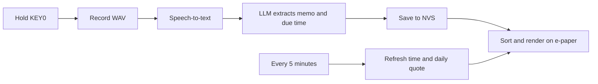

# VoiceMemoReminder

> Hold KEY0, say a reminder, and let the device turn your voice into a sorted e-paper to-do list.

English · [简体中文](README.zh-CN.md)


> Images in this README are generated concept visuals for explaining the interaction and UI. They are not hardware photos.

## Why This Is Useful

VoiceMemoReminder is not just a recorder. It turns natural speech into reminders that can be sorted, checked off, persisted, and shown quietly on an e-paper screen.

- 🎙️ **Speak to capture**: hold KEY0 to record, release to upload the WAV to speech-to-text.
- 🧠 **AI understands time**: phrases like "tomorrow morning" or "tonight at eight" become reminder text plus a due time.
- 🖋️ **Always-on e-paper**: a low-distraction desk display for the next thing you should remember.
- ⏱️ **Time stays fresh**: the idle screen refreshes every 5 minutes, so the header clock does not freeze at the last recording time.
- ☀️ **Daily quote**: the footer shows one upbeat, lightly funny line per day; English firmware gets English, Chinese firmware gets Chinese.

## Feature Tour

### Sorted By Due Time


Reminders are not left in recording order. The list is sorted by event time: the soonest upcoming reminder stays at the top, later reminders move down, overdue items are labeled clearly, and completed items sink to the bottom.

### 8 Reminders Per Page

The E1003 card UI shows up to 8 reminders on one page. Each card includes:

- a checkbox on the left
- the reminder text in the middle
- a date chip and time on the right
- battery, WiFi, current time, and current date in the header

### Completed Items Fade Away


Tap the checkbox to mark a reminder done. Completed cards turn gray and move to the bottom, keeping active reminders visually front and center. When the list is full, new reminders evict completed items first.

### 5-Minute Clock Refresh + Daily Quote

The idle screen redraws every 5 minutes. That refresh updates the clock, date, overdue labels, sort order, and footer quote. If the refresh crosses into a new local day, the device asks the same Groq chat API for a new motivational one-liner and caches it in NVS.

If WiFi or the API is unavailable, the device keeps the old quote. If no quote has ever been fetched, it shows a local fallback line.

### RTC Build-Time Seeding

On boot, the firmware reads the onboard PCF8563 RTC. If the RTC is invalid or earlier than the firmware build time by more than 60 seconds, the device writes the build time into the RTC. If the RTC is already later than the build time, it is left alone so a normal reboot after upload does not rewind the clock.

### Persistent Storage

Reminders are stored in ESP32-S3 NVS. A reboot or power cycle restores the list automatically. Switching between English and Chinese firmware clears the old language's reminders so the list does not mix languages.

### English And Chinese Firmware Builds


The UI supports English and Simplified Chinese as separate build-time firmware targets:

- English builds: `reterminal_e1001`, `reterminal_e1002`, `reterminal_e1003`
- Chinese build: `reterminal_e1003_zh`

The Chinese build renders UI text through OpenFontRender and asks the LLM to return Chinese reminder text.

### Free API Friendly


The default setup uses Groq's OpenAI-compatible API:

| Purpose | Default model | Role |
| --- | --- | --- |
| Speech-to-text | `whisper-large-v3-turbo` | Transcribes the WAV recording |
| Reminder extraction | `llama-3.3-70b-versatile` | Extracts memo text and due time |
| Daily quote | `llama-3.3-70b-versatile` | Generates one encouraging line per day |

Groq's free plan does not charge by default; when limits are exceeded the API usually returns `429`. As of 2026-05-31, Groq's official limits page listed these free-tier limits. Always check [Groq Console Limits](https://console.groq.com/docs/rate-limits) for the current values:

| Model | Free limit summary |
| --- | --- |
| `whisper-large-v3-turbo` | 20 RPM, 2K RPD, 7.2K ASH, 28.8K ASD |
| `llama-3.3-70b-versatile` | 30 RPM, 1K RPD, 12K TPM, 100K TPD |

For more daily headroom, you can switch the chat model to a lighter one such as `llama-3.1-8b-instant`. This repository keeps `llama-3.3-70b-versatile` as the default for better extraction quality.

## Supported Hardware

| Device | Status | Notes |
| --- | --- | --- |
| reTerminal E1001 | Supported | 4-level gray UI |
| reTerminal E1002 | Supported | 6-color UI |
| reTerminal E1003 | Supported | 16-level gray card UI |
| reTerminal E1003 Chinese firmware | Supported | OpenFontRender + embedded Chinese font |
| reTerminal E1004 | Not included | No onboard microphone |

## Quick Start

### 1. Install PlatformIO

Install [PlatformIO](https://platformio.org/) through VS Code or the command line.

### 2. Configure Secrets

Copy the example file:

```sh
cp include/secrets.example.h src/secrets.h
```

Then edit `src/secrets.h` with your WiFi credentials and API key:

```cpp
#define VM_WIFI_SSID     "your_wifi_ssid"
#define VM_WIFI_PASSWORD "your_wifi_password"
#define VM_GROQ_API_KEY  "your_groq_api_key"
```

`src/secrets.h` is ignored by Git. Do not put real API keys in README files, examples, or commits.

### 3. Build And Upload

```sh
# reTerminal E1001
pio run -e reterminal_e1001 --target upload

# reTerminal E1002
pio run -e reterminal_e1002 --target upload

# reTerminal E1003 English
pio run -e reterminal_e1003 --target upload

# reTerminal E1003 Simplified Chinese
pio run -e reterminal_e1003_zh --target upload
```

Monitor serial output:

```sh
pio device monitor
```

## How It Works



Core flow:

1. `VoiceMemoApp` watches KEY0 and controls the recording lifecycle.
2. `AudioCapture` records WAV audio from the PDM microphone.
3. `SpeechClient` calls the speech-to-text API.
4. `MemoClient` rewrites the transcript into `{memo, due, due_label}`.
5. `MemoStore` persists reminders and sorts them by due time.
6. `DailyQuoteClient` fetches and caches the daily quote.
7. `MemoUI` renders the e-paper screen and checkbox hit zones.

## Project Map

| Module | Responsibility |
| --- | --- |
| `src/main.cpp` | PlatformIO entry point and user config |
| `VoiceMemoApp.*` | App orchestration, button state, lifecycle |
| `AudioCapture.*` | Microphone recording and WAV buffer |
| `SpeechClient.*` | Speech-to-text upload |
| `MemoClient.*` | LLM reminder extraction |
| `DailyQuoteClient.*` | Daily quote generation and NVS cache |
| `MemoStore.*` | NVS persistence, sorting, done state |
| `MemoUI.*` | E-paper drawing and touch hit testing |
| `TextRenderer.*` | English and Chinese text rendering |
| `UiLang.h` | Fixed UI strings and language selection |
| `gateway/` | Optional local debug gateway |

## Contributing

Good first places to look:

- UI layout: `MemoUI.cpp`
- Chinese font rendering: `TextRenderer.cpp` and `scripts/gen_font.py`
- Speech provider support: `SpeechClient.cpp`
- Reminder prompt tuning: `MemoClient.cpp`
- Daily quote behavior: `DailyQuoteClient.cpp`
- Persistence behavior: `MemoStore.cpp`

Before submitting changes, run:

```sh
pio test -e native
```

## Security Notes

- Keep real WiFi passwords and API keys only in `src/secrets.h`.
- Example files should contain placeholders only.
- The HTTPS examples use simplified certificate handling for developer convenience. Production firmware should pin a CA certificate or public key.
- Free API limits can change. Treat the provider console as the source of truth.
