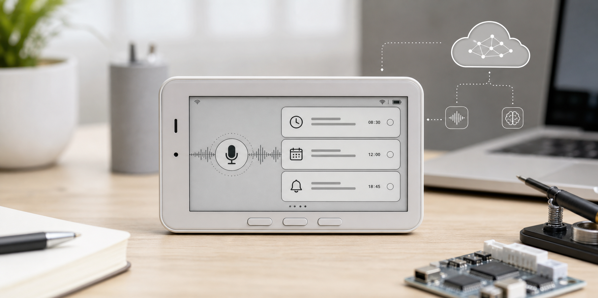
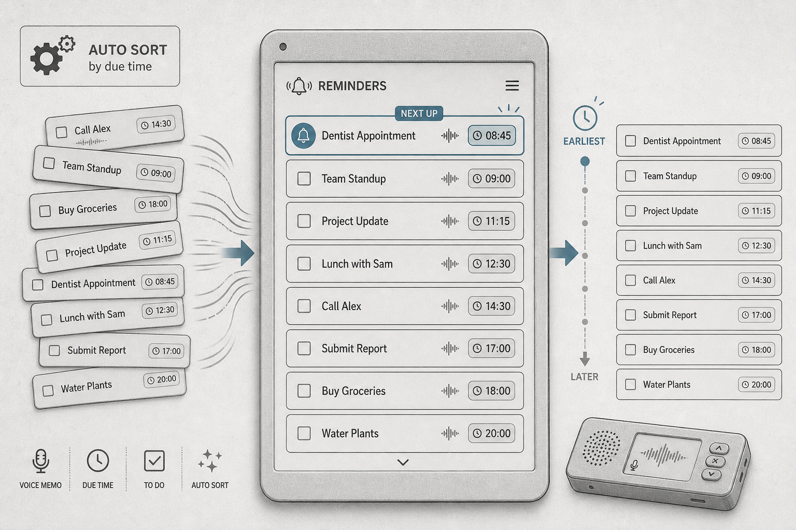
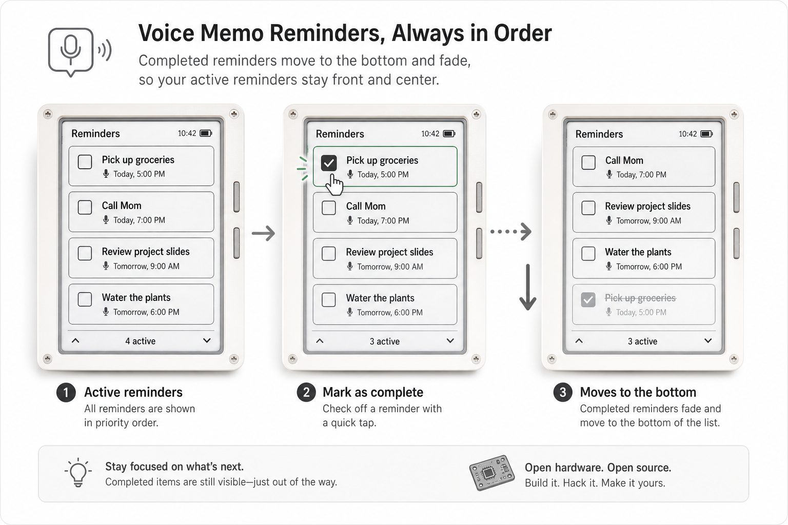
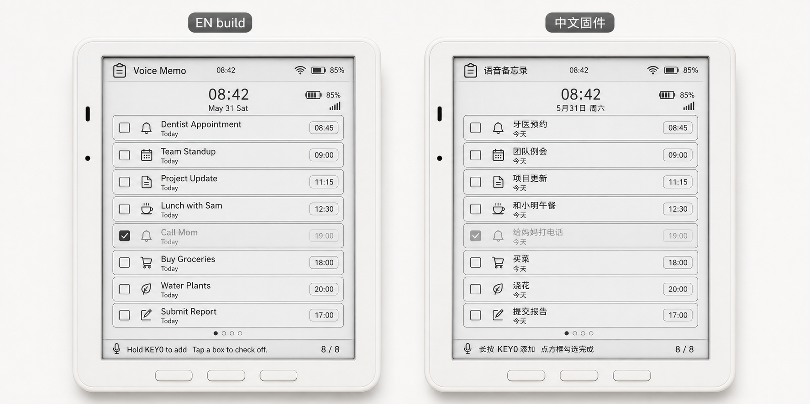
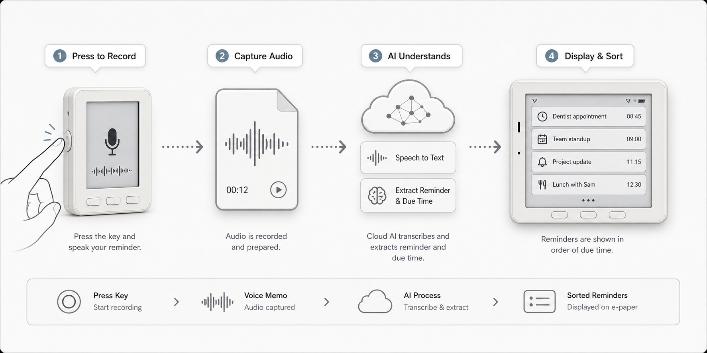
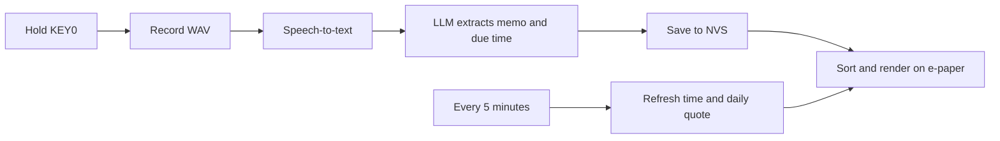

# VoiceMemoReminder

> 按住 KEY0 说一句话，松手后自动识别语音、理解时间、生成提醒，并把最该做的事排在电子墨水屏最前面。

[English](README.md) · 简体中文



> 图片为项目示意图，用于展示交互和界面效果，不代表真实硬件拍摄。

## 为什么它好用

VoiceMemoReminder 不是普通录音机。它会把一句自然语言变成一条可排序、可勾选、可保存的提醒：

- 🎙️ **说话即记录**：按住 KEY0 开始录音，松手后自动上传 WAV 到语音识别 API。
- 🧠 **AI 理解时间**：例如“明早九点开会”“今晚八点买菜”，会被整理成提醒内容和触发时间。
- 🖋️ **电子墨水屏常驻显示**：低功耗、少打扰，适合放在桌面当待办提醒板。
- ⏱️ **时间自动刷新**：空闲时每 5 分钟刷新一次屏幕，顶部时间不会停在上次录音结束的瞬间。
- ☀️ **每日一句**：底部右侧显示当天生成的鼓励短句，跨天后自动更新，中文固件显示中文，英文固件显示英文。

## 功能展示

### 自动按时间排序



提醒不是按录入顺序堆在一起，而是按事件时间排序：越快触发的越靠前，时间更晚的自动排到后面。你可以连续录入多条提醒，设备会自己整理列表。

### 8 条备忘录一页看完

E1003 的卡片式界面每页最多显示 8 条备忘录。每条卡片都包含：

- 左侧勾选框
- 中间提醒内容
- 右侧日期标签和时间
- WiFi、电量、当前时间等状态信息

### 勾选完成后自动变灰



点一下卡片左侧方框即可标记完成。完成项会自动变灰，并下沉到列表底部，让未完成事项始终保持在视觉中心。列表满了以后，新提醒会优先覆盖已完成项目，减少手动整理成本。

### 每 5 分钟刷新时间和每日一句

屏幕会在空闲时每 5 分钟自动刷新一次。它会更新顶部时间、日期、逾期状态和排序；如果这次刷新刚好跨过新的一天，还会通过同一个 Groq Chat Completions API 生成新的每日一句。

每日一句会缓存在 NVS 中，同一天重启不会反复消耗 API。网络不可用时会保留旧句子；没有旧句子时显示本地默认短句。

### RTC 构建时间校准

设备开机时会先读取板载 PCF8563 RTC。如果 RTC 无效，或者 RTC 时间比本次固件构建时间早超过 60 秒，设备会把构建时间写入 RTC。如果 RTC 已经晚于构建时间，则不会更新，避免上传后正常重启时把时钟倒拨回上传那一刻。

### 断电也不会丢

提醒会保存到 ESP32-S3 的 NVS 中。设备重启或断电后，备忘录列表会自动恢复；切换中文/英文固件时会清空旧语言的提醒，避免不同语言内容混在一起。

### 中英双语固件



项目支持英文和简体中文两套 UI。语言是编译时选择：

- 英文构建：`reterminal_e1001`、`reterminal_e1002`、`reterminal_e1003`
- 中文构建：`reterminal_e1003_zh`

中文构建会使用 OpenFontRender 渲染中文界面，并提示 LLM 返回中文提醒内容。

### 免费 API 也能跑



默认配置使用 Groq 的 OpenAI-compatible API：

| 用途 | 默认模型 | 作用 |
| --- | --- | --- |
| 语音识别 | `whisper-large-v3-turbo` | 把录音转成文字 |
| 提醒整理 | `llama-3.3-70b-versatile` | 从文字里提取提醒和时间 |
| 每日一句 | `llama-3.3-70b-versatile` | 每天生成一句鼓励短句 |

Groq 免费计划不会直接扣费，超过免费限制时通常返回 `429`。截至 2026-05-31，官方 Limits 页展示的免费层级摘要如下，实际额度请以 [Groq Console Limits](https://console.groq.com/docs/rate-limits) 为准：

| 模型 | 免费限制摘要 |
| --- | --- |
| `whisper-large-v3-turbo` | 20 RPM、2K RPD、7.2K ASH、28.8K ASD |
| `llama-3.3-70b-versatile` | 30 RPM、1K RPD、12K TPM、100K TPD |

如果你希望日常额度更宽松，可以在配置里改用更轻量的聊天模型，例如 `llama-3.1-8b-instant`。本仓库默认代码保持 `llama-3.3-70b-versatile`，优先保证理解质量。

## 支持硬件

| 设备 | 状态 | 说明 |
| --- | --- | --- |
| reTerminal E1001 | 支持 | 4 级灰阶 UI |
| reTerminal E1002 | 支持 | 6 色 UI |
| reTerminal E1003 | 支持 | 16 级灰阶卡片 UI |
| reTerminal E1003 中文固件 | 支持 | OpenFontRender + 内嵌中文字体 |
| reTerminal E1004 | 暂不支持 | 没有板载麦克风 |

## 快速开始

### 1. 安装 PlatformIO

安装 [PlatformIO](https://platformio.org/)，可以使用 VS Code 插件，也可以使用命令行。

### 2. 配置密钥

复制示例文件：

```sh
cp include/secrets.example.h src/secrets.h
```

然后编辑 `src/secrets.h`，填入你的 WiFi 和 API key：

```cpp
#define VM_WIFI_SSID     "your_wifi_ssid"
#define VM_WIFI_PASSWORD "your_wifi_password"
#define VM_GROQ_API_KEY  "your_groq_api_key"
```

`src/secrets.h` 已经写入 `.gitignore`，不会被提交。请不要把真实 API key 写进 README、示例文件或提交记录。

### 3. 编译和烧录

```sh
# reTerminal E1001
pio run -e reterminal_e1001 --target upload

# reTerminal E1002
pio run -e reterminal_e1002 --target upload

# reTerminal E1003 English
pio run -e reterminal_e1003 --target upload

# reTerminal E1003 简体中文
pio run -e reterminal_e1003_zh --target upload
```

查看串口日志：

```sh
pio device monitor
```

## 它怎么工作



核心数据流：

1. `VoiceMemoApp` 监听 KEY0，控制录音生命周期。
2. `AudioCapture` 从 PDM 麦克风采集 WAV。
3. `SpeechClient` 调用语音识别接口。
4. `MemoClient` 把转写文本整理成 `{memo, due, due_label}`。
5. `MemoStore` 持久化保存并按时间排序。
6. `MemoUI` 绘制电子墨水屏界面并处理勾选命中区域。

## 项目结构

| 模块 | 职责 |
| --- | --- |
| `src/main.cpp` | PlatformIO 入口和用户配置 |
| `VoiceMemoApp.*` | 应用编排、按键、生命周期 |
| `AudioCapture.*` | 麦克风录音和 WAV 缓冲 |
| `SpeechClient.*` | 语音识别上传 |
| `MemoClient.*` | LLM 提醒提取 |
| `DailyQuoteClient.*` | 每日一句生成和 NVS 缓存 |
| `MemoStore.*` | NVS 保存、排序、完成状态 |
| `MemoUI.*` | 电子墨水屏绘制和触摸命中 |
| `TextRenderer.*` | 英文/中文文本渲染 |
| `UiLang.h` | 固定 UI 文案和语言选择 |
| `gateway/` | 可选本地调试网关 |

## 贡献

欢迎按模块贡献：

- 想改界面：看 `MemoUI.cpp`
- 想调中文字体：看 `TextRenderer.cpp` 和 `scripts/gen_font.py`
- 想换语音识别平台：看 `SpeechClient.cpp`
- 想换提醒提取提示词：看 `MemoClient.cpp`
- 想改保存策略：看 `MemoStore.cpp`

建议提交前至少运行：

```sh
pio test -e native
```

## 安全提示

- 真实 WiFi 密码和 API key 只放在 `src/secrets.h`。
- 示例文件只能放占位符。
- 默认 HTTPS 示例为了开发方便使用简化证书校验；产品化固件应固定 CA 证书或公钥。
- 免费 API 额度可能变化，请以服务商控制台显示为准。
