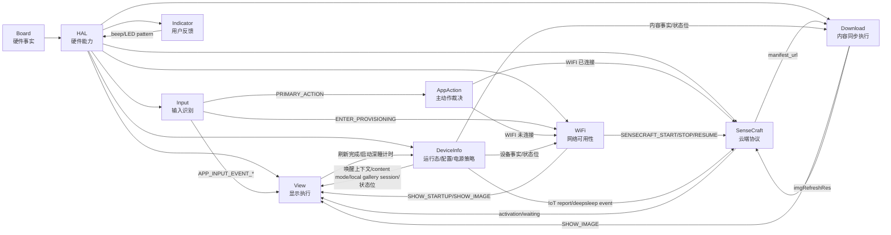
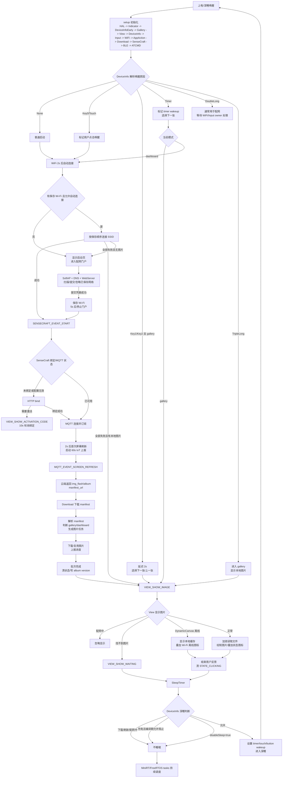
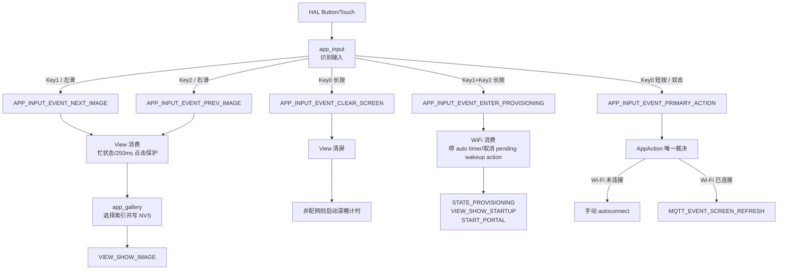
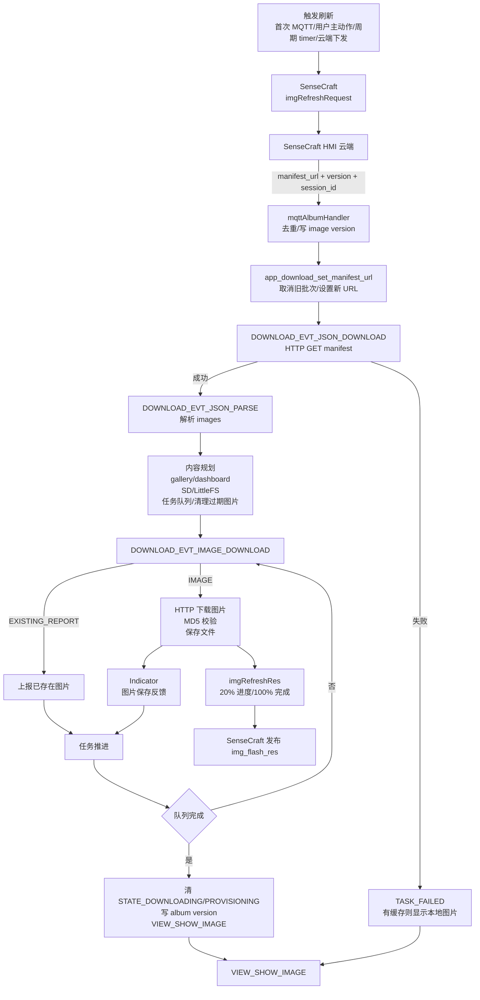
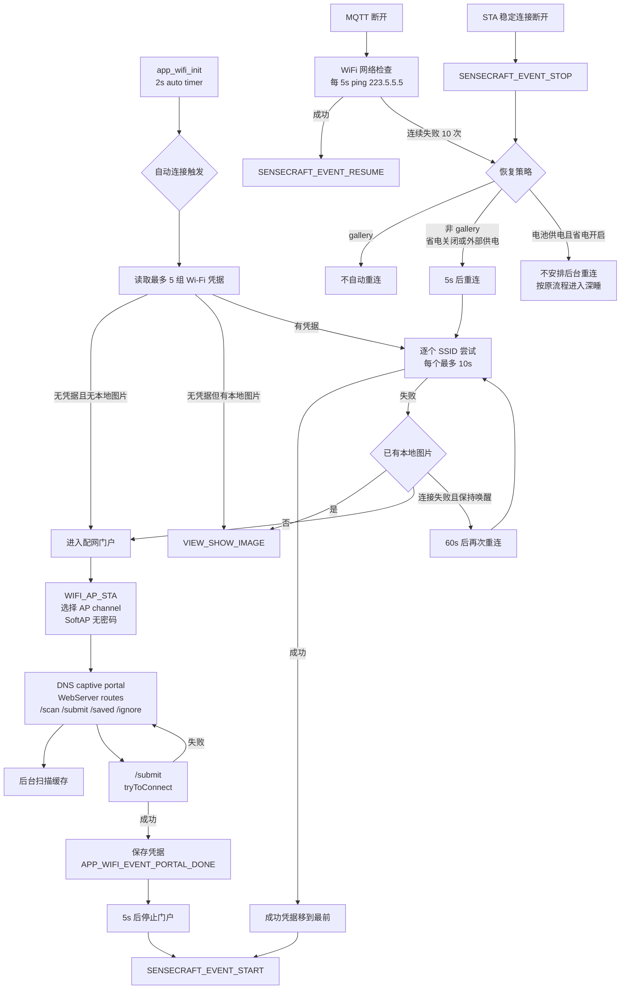
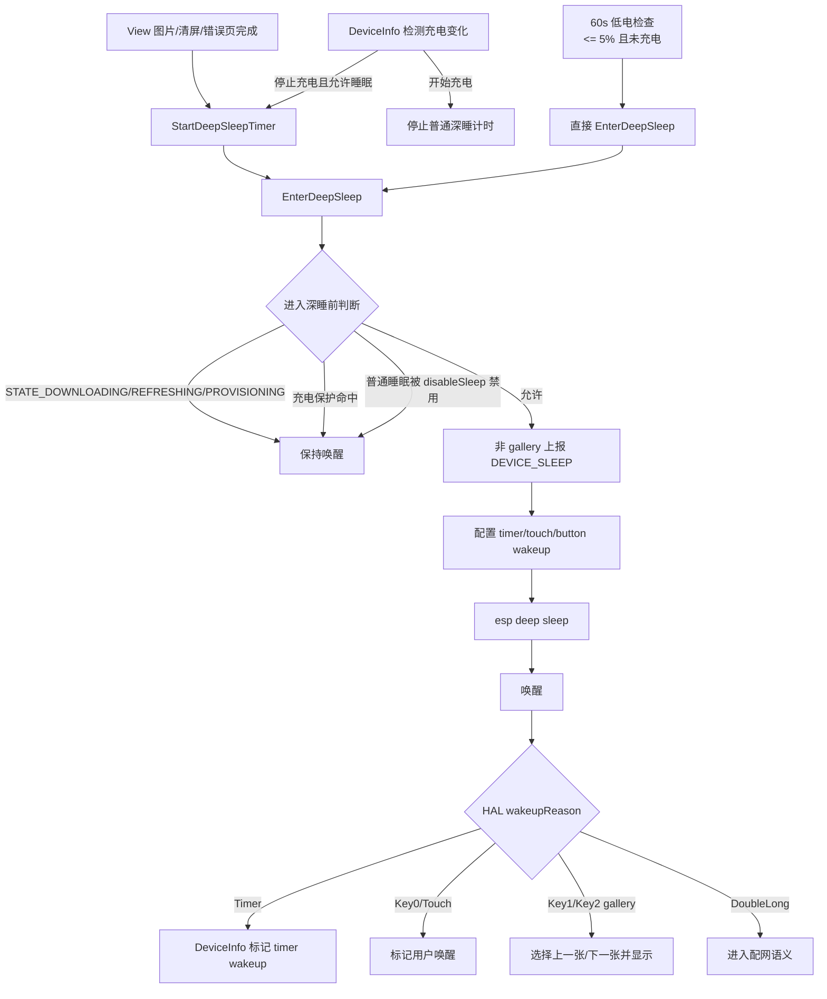
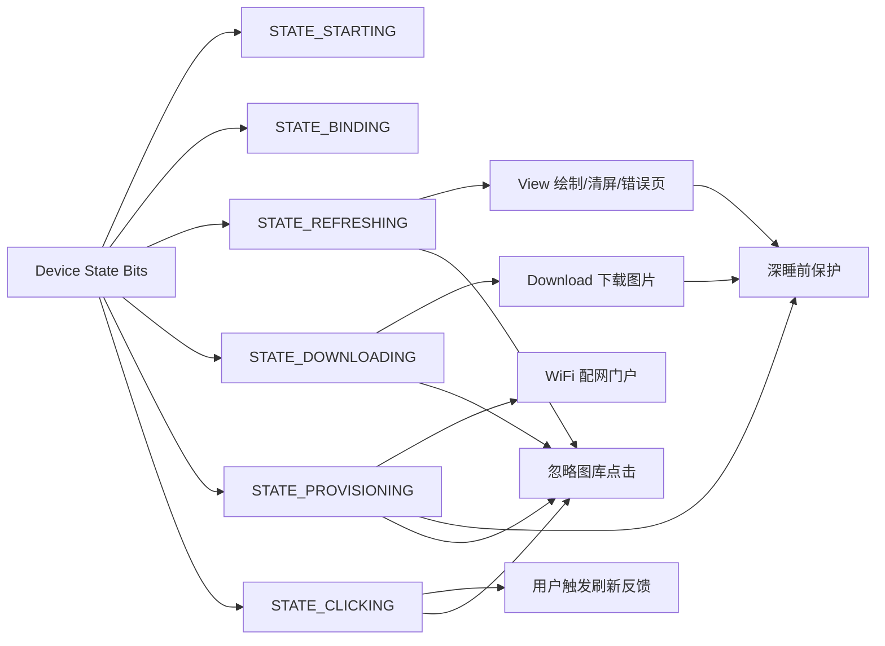

# 设备交互流程图

本文基于 `docs/` 下各 APP 功能模型和 `src/main.cpp` 的初始化顺序整理。目标是先看清当前设备交互闭环，再为后续按第一性原理拆模块做收敛。

## 1. 模块边界总览

第一性原理边界：

- Board 只描述硬件事实。
- HAL 只暴露硬件能力和状态。
- APP 模块只处理产品策略和业务状态。
- Input 只发布稳定输入事件，不直接做 Wi-Fi、云端、显示决策。
- View 只执行显示，但当前仍混有 manifest 查图和刷新后休眠策略。
- DeviceInfo 当前实际是运行态、配置、电源策略、唤醒策略聚合点。

## 2. 设备主流程

## 3. 用户输入链路

优化收敛点：

- `PRIMARY_ACTION` 仍是复合语义。若产品确定 Key0/双击只做云端刷新，应删除 `PRIMARY_ACTION`，直接发布 `REQUEST_CLOUD_REFRESH`。
- 唤醒后的 Key1/Key2/Touch 和运行时输入应继续复用 `app_gallery` 的索引选择规则，避免两套切图语义。

## 4. 内容刷新链路

优化收敛点：

- Download 可拆为 `manifest parser`、`content planner`、`download executor`、`storage cleanup`。
- gallery/dashboard 判断依赖 URL 包含 `/img/`，需要确认这是协议契约还是临时规则。
- manifest index range 现在由 Download 暴露给 Gallery。后续可以收敛为独立内容索引模型，给 View、DeviceInfo、SenseCraft 共用。

## 5. 网络与配网链路

优化收敛点：

- WiFi 当前同时包含 STA、SoftAP、WebServer、DNS、扫描缓存、重连策略。迁移到 IDF 时可按 `wifi_station`、`wifi_softap`、`provision_http`、`dns_captive` 拆边界。
- `tryToConnect()` 依赖扫描缓存。门户提交时合理，AT/BLE 指定连接时需要定义缓存为空的行为。
- 固定 ping `223.5.5.5` 需要按目标市场确认。

## 6. 深睡与唤醒链路

优化收敛点：

- `disableSleep` 只控制普通自动深睡，不控制低电保护。
- DeviceInfo 当前聚合了运行态、NVS、深睡、低电、唤醒、SD/充电监测。后续优先拆成 `device_state`、`device_config`、`power_policy`、`wakeup_policy`，比继续扩展 `device_info` 更清晰。

## 7. 状态位保护关系

后续重构建议先收敛状态 owner：

- 状态位的写入 owner 要明确，避免多个模块写同一个状态但不知道生命周期。
- `STATE_CLICKING` 应继续归 `app_user_action` 收尾，不放回 View 或 Input。
- `STATE_PROVISIONING` 应归 WiFi/portal 生命周期，Download 结束时清它属于历史耦合点，需要后续确认是否仍必要。
